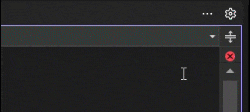
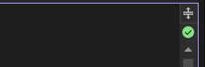
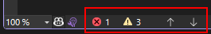

[marketplace]: https://marketplace.visualstudio.com/items?itemName=MadsKristensen.DocumentHealth
[vsixgallery]: http://vsixgallery.com/extension/DocumentHealth.ebd2f3af-c274-4af6-bc9d-3e929361845d/
[repo]: https://github.com/madskristensen/DocumentHealth

# Document Health for Visual Studio

Download this extension from the [Visual Studio Marketplace][marketplace] or get the [CI build][vsixgallery].

---

A lightweight Visual Studio extension that displays document health status (errors, warnings, and messages) as an icon above the vertical scroll bar.

## Features

### At-a-Glance Status Indicator

An icon at the top of the scroll bar shows your document's health:

| Icon | Status |
|------|--------|
| 🟢 Green | No errors or warnings |
| 🟡 Yellow | Warnings present |
| 🔴 Red | Errors present |

### Hover for Details

Hover over the icon to see the exact count of errors, warnings, and messages.

### Cleaner Editor Layout

This extension replaces the built-in *Document Health Indicator* at the bottom left of the editor, freeing up space for the horizontal scrollbar.

## Keyboard Shortcuts

Use Visual Studio's built-in shortcuts to navigate between issues:

| Shortcut | Action |
|----------|--------|
| `Ctrl+Shift+F12` | Go to next error |
| `Alt+PgDn` | Go to next error/warning |
| `Alt+PgUp` | Go to previous error/warning |

You can also **click the icon** to jump to the next error, or **right-click** to access additional options:

- Go to Next/Previous Error
- Open Error List
- Settings

## Options

Configure the extension under **Tools → Options → Environment → Document Health**:

| Option | Description | Default |
|--------|-------------|---------|
| Update delay (ms) | Delay before updating the indicator after changes. Higher values improve performance during rapid typing. | 250 |
| Show messages count | Include suggestions and informational messages in the tooltip count. | true |

## How Can I Help?

If you find this extension useful:

- ⭐ [Rate it on the Visual Studio Marketplace][marketplace]
- 🐛 [Report bugs or request features][repo]
- 🔧 Submit a pull request
- 💖 [Sponsor me on GitHub](https://github.com/sponsors/madskristensen)