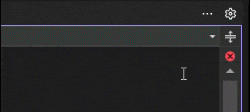
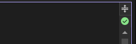
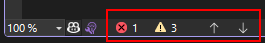
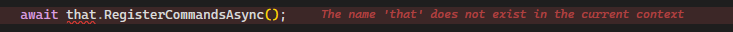

[marketplace]: https://marketplace.visualstudio.com/items?itemName=MadsKristensen.DocumentHealth
[vsixgallery]: http://vsixgallery.com/extension/DocumentHealth.ebd2f3af-c274-4af6-bc9d-3e929361845d/
[repo]: https://github.com/madskristensen/DocumentHealth

# Document Health for Visual Studio

Download this extension from the [Visual Studio Marketplace][marketplace] or get the [CI build][vsixgallery].

---

A lightweight Visual Studio extension that provides comprehensive document health visualization through scroll bar indicators, inline diagnostics, gutter icons, and line highlighting.

## Features

### At-a-Glance Status Indicator

An icon at the top of the scroll bar shows your document's health:

| Icon | Status |
|------|--------|
| 🟢 Green | No errors or warnings |
| 🟡 Yellow | Warnings present |
| 🔴 Red | Errors present |

### Hover for Details

Hover over the icon to see the exact count of errors, warnings, and messages.

### Cleaner Editor Layout

By default, this extension replaces the built-in *Document Health Indicator* at the bottom left of the editor, freeing up space for the horizontal scrollbar.

You can keep the built-in indicator if you prefer (see **Options** below).

## Keyboard Shortcuts

Use Visual Studio's built-in shortcuts to navigate between issues:

| Shortcut | Action |
|----------|--------|
| `Ctrl+Shift+F12` | Go to next error |
| `Alt+PgDn` | Go to next error/warning |
| `Alt+PgUp` | Go to previous error/warning |

You can also **click the icon** to jump to the next error, or **right-click** to access additional options:

- Go to Next/Previous Error
- Open Error List
- Settings

### Inline Diagnostics

See diagnostic messages directly in the editor, right at the end of the line that caused them — no need to check the Error List.

Right-click on any inline diagnostic message to access a context menu with useful actions:

- **Copy Diagnostic Message** — Copy the diagnostic text to the clipboard
- **Copy Diagnostic Code** — Copy the diagnostic code (e.g., CS0168) to the clipboard
- **Search Online** — Search for the diagnostic on Bing to find solutions

#### Message Templates

Customize the format of inline diagnostic messages using a template string. The default template is `{message}`, which shows just the diagnostic text.

Supported placeholders:

| Placeholder | Description | Example |
|-------------|-------------|---------|
| `{message}` | The diagnostic message text | The variable 'x' is declared but never used |
| `{code}` | The diagnostic code | CS0168 |
| `{severity}` | The severity level | Error, Warning, Info |
| `{source}` | The analyzer/source name | — |

Example templates:

| Template | Result |
|----------|--------|
| `{message}` | The variable 'x' is declared but never used |
| `{code}: {message}` | CS0168: The variable 'x' is declared but never used |
| `[{severity}] {message}` | [Warning] The variable 'x' is declared but never used |
| `{severity} {code}: {message}` | Warning CS0168: The variable 'x' is declared but never used |

### Gutter Icons

Diagnostic icons appear in the editor gutter (left margin) for lines containing errors, warnings, or suggestions. The icons use the same severity-based colors as the scroll bar indicator:

- 🔴 Error icon for errors
- 🟡 Warning icon for warnings
- ℹ️ Information icon for suggestions

Right-click on any gutter icon to access the same context menu as inline diagnostics (copy message, copy code, search online).

You can configure which severity levels show gutter icons in the options.

### Line Highlighting

Lines with errors or warnings are highlighted with a subtle background tint colored by severity:

- **Red** tint for errors
- **Yellow** tint for warnings
- **Blue** tint for suggestions (when enabled)

Both features can be toggled independently in the options.

### Customizable Colors

All diagnostic colors can be customized through Visual Studio's native **Tools → Options → Environment → Fonts and Colors** page. Look for the **Document Health** items:

| Display Item | Foreground (inline text) | Background (line highlight) | Default Color |
|---|---|---|---|
| Document Health - Error | Inline error message color | Error line highlight | Red (`#E45454`) |
| Document Health - Warning | Inline warning message color | Warning line highlight | Orange (`#FF942F`) |
| Document Health - Message | Inline info message color | Info line highlight | Blue (`#00B7E4`) |

Each entry also exposes **Bold** and **Italic** options for the inline message font style. Colors update live when changed — no restart required.

## Options

Configure the extension under **Tools → Options → Environment → Document Health**:

### Behavior

| Option | Description | Default |
|--------|-------------|---------|
| Update delay (ms) | Delay before updating the indicator after changes. Higher values improve performance during rapid typing. | 250 |
| Show messages count | Include suggestions and informational messages in the tooltip count. | true |
| Replace built-in indicator | Disable Visual Studio's built-in file health indicator and use this extension's indicator instead. | true |

### Inline Diagnostics

| Option | Description | Default |
|--------|-------------|---------|
| Show inline messages | Display diagnostic messages inline at the end of lines containing errors or warnings. | true |
| Show gutter icons | Controls which severity levels get gutter icons in the editor margin. Options: None, Errors, Errors and Warnings, All. | Errors and Warnings |
| Show errors | Include error diagnostics in the inline messages and line highlights. | true |
| Show warnings | Include warning diagnostics in the inline messages and line highlights. | true |
| Show suggestions | Include informational and suggestion diagnostics in the inline messages and line highlights. | false |
| Highlight lines | Controls which severity levels get line background highlighting. Options: None, Errors, Errors and Warnings, All. | Errors and Warnings |
| Message template | Customize the format of inline messages using placeholders: `{message}`, `{code}`, `{severity}`, `{source}`. | `{message}` |

### Notes on behavior

- The indicator performs an initial health calculation when a document opens.
- Updates use debounce behavior, so rapid typing delays refresh until activity settles.
- Gutter icons and inline messages share the same context menu for quick access to diagnostic actions.

## How Can I Help?

If you find this extension useful:

- ⭐ [Rate it on the Visual Studio Marketplace][marketplace]
- 🐛 [Report bugs or request features][repo]
- 🔧 Submit a pull request
- 💖 [Sponsor me on GitHub](https://github.com/sponsors/madskristensen)